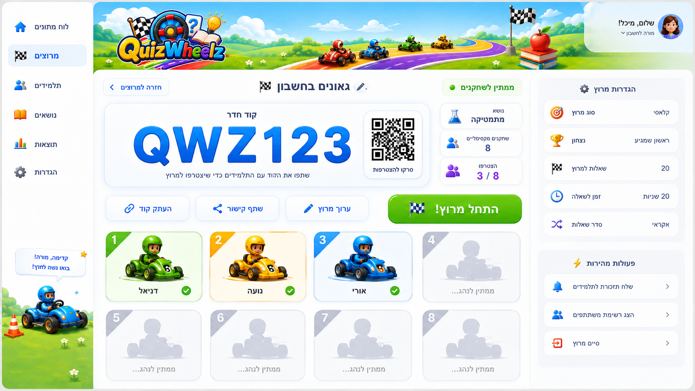
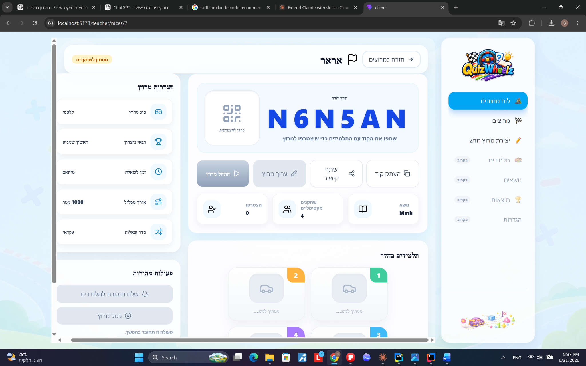

# Issue 12B — Teacher Race Waiting Room UI Plan

## Read this first

This document is the working plan for the **Teacher Race Waiting Room UI** in the QuizWheelz project.

The current screen is too large, overflows horizontally/vertically, and does not match the target design. The goal is to refactor and polish the waiting-room page so it looks close to the provided design screenshot while following the project’s component, content, config, and style rules.

This is **not** the live race screen. It is the **teacher waiting room before the race starts**.

The live race screen will be a future feature and will include real-time updates, race track, moving cars, SSE, score, progress, and results. Do not implement any of that here.

---

## Visual references

### Target design

Use this image as the visual target:



### Current problem

The current local implementation is too large and overflows:



---

## Branch and scope

Expected working branch:

```text
feature/issue-12b-teacher-race-room-ui
```

The existing page file stays named:

```text
client/src/features/teacherDashboard/pages/TeacherRaceRoomPage.jsx
```

Even though the file name says `RaceRoom`, the UI being built inside it is currently the **waiting room**.

Do not rename routes or backend endpoints in this task.

---

## Non-negotiable coding rules

### 1. No long Tailwind strings inside components

All reusable or fixed Tailwind classes must live in:

```text
client/src/features/teacherDashboard/styles/raceWaitingRoomStyles.js
```

Components should use constants such as:

```js
WAITING_ROOM_LAYOUT_STYLES.page
WAITING_ROOM_CODE_STYLES.code
WAITING_ROOM_PARTICIPANT_STYLES.slot
```

### 2. No user-facing text inside components

All displayed text must live in:

```text
client/src/features/teacherDashboard/content/teacherDashboardContent.js
```

Use:

```js
TEACHER_RACE_WAITING_ROOM_CONTENT
```

Examples of text that must not be hardcoded in JSX:

```text
Back to races
Room code
Copy code
Start race
Cancel race
Waiting for driver...
Race settings
```

### 3. No structural constants inside components

Repeated structural definitions must live in:

```text
client/src/features/teacherDashboard/config/raceWaitingRoomConfig.js
```

Examples:

```js
WAITING_ROOM_INFO_CARD_ITEMS
WAITING_ROOM_SETTINGS_ITEMS
WAITING_ROOM_QUICK_ACTION_ITEMS
WAITING_ROOM_SLOT_COLORS
```

### 4. Reuse existing components

Do not create a new generic button or status badge if an existing one exists.

Use existing:

```text
DashboardButton
RaceStatusBadge
cx
```

### 5. Do not add new libraries

Do not add a QR library right now.
Do not add an image or avatar library.
Do not add animation/game libraries.
Use `lucide-react`, because it already exists in the project.

### 6. Do not implement future features now

Do not implement:

```text
Start race API
Edit race flow
Cancel race API
Real QR generation
Student join flow
SSE
PixiJS
Live race screen
Vehicle selection
Real vehicle images
```

Only build the waiting-room UI shell and keep future hooks/placeholders clean.

---

## Main visual goal

The layout should match the target image as closely as possible while using the current project structure.

Required visual layout:

```text
Teacher layout / sidebar stays as it is
Future top teacher banner/header will be added later
Current waiting-room content starts under that area

Waiting room page:
 ├─ Compact header bar
 │   ├─ Back to races button
 │   ├─ Race title + flag icon
 │   └─ Race status badge
 │
 ├─ Content grid
 │   ├─ Main column
 │   │   ├─ Join panel
 │   │   │   ├─ Room code + QR placeholder
 │   │   │   ├─ Copy / Share / Edit / Start buttons
 │   │   │   └─ Subject / max players / joined info cards
 │   │   └─ Participant slot grid
 │   │
 │   └─ Right side panel
 │       ├─ Race settings panel
 │       └─ Quick actions panel
```

---

## Important design correction: compact header bar

The current header area where the race name appears is too big.

It must look like the target screenshot:

```text
A compact bar at the top of the waiting-room content area.
Back button on one side.
Race title centered/visually balanced.
Status badge on the other side.
Height should feel like a toolbar, not like a big card.
```

Rules for this header:

```text
Do not make it tall.
Do not add a large description under the race title.
Do not let it push content down too much.
Do not let it move unpredictably.
Keep it inside the waiting-room content area.
Keep it visually aligned with the columns below.
```

Suggested style values are included below in `raceWaitingRoomStyles.js`.

---

## Future top teacher banner/header

The top banner with the teacher picture, teacher name, and logout button is still planned.

For this task:

```text
Do not redesign it.
Do not create it from scratch here.
Do not remove layout space needed for it.
Do not break the existing teacher layout.
```

Later, it should be added at a higher layout level, likely around the teacher dashboard layout/header area, so it appears consistently across teacher pages.

This task should only style the existing waiting-room content.

---

## Required immediate fixes

### Fix 1 — remove “Send reminder to students”

This action is not needed now and may become a separate feature later.
Remove it from:

```text
raceWaitingRoomConfig.js
teacherDashboardContent.js
RaceWaitingRoomQuickActionsPanel.jsx
TeacherRaceRoomPage.jsx
RaceWaitingRoomSidePanel.jsx
```

The only quick action for now should be:

```text
Cancel race
```

It can remain disabled until the backend endpoint exists.

### Fix 2 — reduce overflow and oversized UI

The current styles are too big.
Shrink:

```text
page padding
header height
room code size
QR placeholder size
button heights
side panel width
participant slot width/height
card padding
```

### Fix 3 — remove participants title

Do not display:

```text
Students in room
```

The participant cards should appear directly in the participant panel, like in the target screenshot.

### Fix 4 — prepare vehicles for future images, but do not use images yet

Participant slots should support future external vehicle images.

For now:

```text
If player has vehicle image -> show image.
If not -> show neutral placeholder icon.
```

Do not use emoji vehicles as data.
Do not import real car images yet.

---

## File-by-file implementation plan

### 1. `client/src/features/teacherDashboard/config/raceWaitingRoomConfig.js`

Keep config only in this file. Do not put styles here.

Required changes:

```js
export const WAITING_ROOM_QUICK_ACTION_KEYS = Object.freeze({
    CANCEL_RACE: "cancelRace",
});

export const WAITING_ROOM_QUICK_ACTION_ITEMS = Object.freeze([
    {
        key: WAITING_ROOM_QUICK_ACTION_KEYS.CANCEL_RACE,
        contentKey: "cancelRace",
        actionType: "cancel",
        variant: "danger",
        disabled: false,
    },
]);
```

Remove any `REMIND_STUDENTS` key.
Remove any `remindStudents` quick action item.

Also remove this if it exists in config:

```js
export const WAITING_ROOM_INFO_STYLES = Object.freeze(...)
```

Styles must not be inside config.

Keep future vehicle structure like this:

```js
export const WAITING_ROOM_VEHICLE_ASSET_KEYS = Object.freeze([
    "greenCar",
    "yellowCar",
    "blueCar",
    "redCar",
    "purpleCar",
    "orangeCar",
    "cyanCar",
    "pinkCar",
]);

export const WAITING_ROOM_DEFAULT_VEHICLE_ASSET_KEY = "defaultCar";
```

These are only keys for future assets. They are not images and not displayed text.

---

### 2. `client/src/features/teacherDashboard/content/teacherDashboardContent.js`

Inside `TEACHER_RACE_WAITING_ROOM_CONTENT.he.quickActions`, use:

```js
quickActions: {
    title: "פעולות מהירות",
    cancelRace: "בטל מרוץ",
    futureHint: "ביטול מרוץ יחובר בהמשך.",
},
```

Inside `TEACHER_RACE_WAITING_ROOM_CONTENT.en.quickActions`, use:

```js
quickActions: {
    title: "Quick actions",
    cancelRace: "Cancel race",
    futureHint: "Canceling a race will be connected later.",
},
```

Remove:

```text
remindStudents
Send reminder to students
שלח תזכורת לתלמידים
```

Do not remove the waiting-room content object itself.

---

### 3. `client/src/features/teacherDashboard/components/raceWaitingRoom/RaceWaitingRoomQuickActionsPanel.jsx`

Replace with a cancel-only version.

```jsx
import { XCircle } from "lucide-react";
import DashboardButton from "../ui/DashboardButton";
import {
    WAITING_ROOM_QUICK_ACTION_ITEMS,
    WAITING_ROOM_QUICK_ACTION_KEYS,
} from "../../config/raceWaitingRoomConfig";
import {
    WAITING_ROOM_BUTTON_STYLES,
    WAITING_ROOM_SIDE_PANEL_STYLES,
    WAITING_ROOM_TEXT_STYLES,
} from "../../styles/raceWaitingRoomStyles";

const QUICK_ACTION_ICONS = Object.freeze({
    [WAITING_ROOM_QUICK_ACTION_KEYS.CANCEL_RACE]: XCircle,
});

function getActionHandler(actionType, handlers) {
    if (actionType === "cancel") {
        return handlers.onCancelRace;
    }

    return undefined;
}

function getActionDisabled(item, canCancelRace) {
    if (item.actionType === "cancel") {
        return !canCancelRace;
    }

    return item.disabled;
}

export default function RaceWaitingRoomQuickActionsPanel({
    content,
    onCancelRace,
    canCancelRace = false,
}) {
    const handlers = { onCancelRace };

    return (
        <section className={WAITING_ROOM_SIDE_PANEL_STYLES.panel}>
            <h2 className={WAITING_ROOM_TEXT_STYLES.sectionTitle}>
                {content.title}
            </h2>

            <div className={WAITING_ROOM_SIDE_PANEL_STYLES.list}>
                {WAITING_ROOM_QUICK_ACTION_ITEMS.map((item) => {
                    const Icon = QUICK_ACTION_ICONS[item.key];
                    const isDisabled = getActionDisabled(item, canCancelRace);
                    const onClick = getActionHandler(item.actionType, handlers);

                    return (
                        <DashboardButton
                            key={item.key}
                            onClick={onClick}
                            variant={item.variant}
                            disabled={isDisabled}
                            className={WAITING_ROOM_BUTTON_STYLES.sideAction}
                        >
                            {Icon && (
                                <Icon
                                    size={18}
                                    aria-hidden="true"
                                    className={WAITING_ROOM_BUTTON_STYLES.icon}
                                />
                            )}

                            <span>{content[item.contentKey]}</span>
                        </DashboardButton>
                    );
                })}
            </div>

            <p className={WAITING_ROOM_TEXT_STYLES.hint}>
                {content.futureHint}
            </p>
        </section>
    );
}
```

---

### 4. `client/src/features/teacherDashboard/components/raceWaitingRoom/RaceWaitingRoomSidePanel.jsx`

Remove `onRemindStudents`.

```jsx
import RaceWaitingRoomQuickActionsPanel from "./RaceWaitingRoomQuickActionsPanel";
import RaceWaitingRoomSettingsPanel from "./RaceWaitingRoomSettingsPanel";
import { WAITING_ROOM_LAYOUT_STYLES } from "../../styles/raceWaitingRoomStyles";

export default function RaceWaitingRoomSidePanel({
    race,
    content,
    onCancelRace,
    canCancelRace = false,
}) {
    return (
        <aside className={WAITING_ROOM_LAYOUT_STYLES.sideColumn}>
            <RaceWaitingRoomSettingsPanel
                race={race}
                content={content.settings}
            />

            <RaceWaitingRoomQuickActionsPanel
                content={content.quickActions}
                onCancelRace={onCancelRace}
                canCancelRace={canCancelRace}
            />
        </aside>
    );
}
```

---

### 5. `client/src/features/teacherDashboard/pages/TeacherRaceRoomPage.jsx`

Remove the future reminder handler:

```js
function handleRemindStudents() {
    // Future feature.
}
```

Do not pass `onRemindStudents` to `RaceWaitingRoomSidePanel`.

Use:

```jsx
<RaceWaitingRoomSidePanel
    race={raceRoom}
    content={content}
    onCancelRace={handleCancelRace}
    canCancelRace={false}
/>
```

Keep `canCancelRace={false}` for now until the backend endpoint exists.

---

### 6. `client/src/features/teacherDashboard/components/raceWaitingRoom/RaceWaitingRoomParticipantsGrid.jsx`

Remove the visible title from the participant grid.

Remove this import if present:

```js
WAITING_ROOM_TEXT_STYLES,
```

Change this:

```jsx
<section className={WAITING_ROOM_PARTICIPANT_STYLES.panel}>
    <h2 className={WAITING_ROOM_TEXT_STYLES.sectionTitle}>
        {content.title}
    </h2>

    <div className={WAITING_ROOM_PARTICIPANT_STYLES.grid}>
```

To this:

```jsx
<section className={WAITING_ROOM_PARTICIPANT_STYLES.panel}>
    <div className={WAITING_ROOM_PARTICIPANT_STYLES.grid}>
```

Keep the rest of the slot rendering.

---

### 7. `client/src/features/teacherDashboard/styles/raceWaitingRoomStyles.js`

Replace the current oversized styles with this compact version.

```js
export const WAITING_ROOM_LAYOUT_STYLES = Object.freeze({
    page:
        "min-h-0 overflow-y-auto rounded-[28px] bg-white/55 p-3 xl:p-4",

    contentGrid:
        "mt-4 grid min-w-0 gap-4 xl:grid-cols-[minmax(0,1fr)_320px]",

    mainColumn:
        "grid min-w-0 gap-4",

    sideColumn:
        "grid min-w-0 content-start gap-4",
});

export const WAITING_ROOM_HEADER_STYLES = Object.freeze({
    wrapper:
        "flex flex-col gap-3 rounded-[26px] border border-white/80 bg-white/85 px-4 py-3 text-start shadow-[0_8px_22px_rgba(27,42,65,0.08)] md:flex-row md:items-center md:justify-between",

    titleGroup:
        "flex min-w-0 flex-1 flex-col items-center gap-2 text-center md:flex-row md:text-start",

    titleIcon:
        "text-2xl text-slate-800",

    title:
        "truncate text-xl font-black text-slate-900 md:text-2xl",

    backButton:
        "min-h-10 gap-2 rounded-2xl px-4 text-sm",
});

export const WAITING_ROOM_CARD_STYLES = Object.freeze({
    panel:
        "rounded-[26px] border border-white/80 bg-white/90 p-4 text-start shadow-[0_8px_22px_rgba(27,42,65,0.08)]",

    joinPanel:
        "rounded-[26px] border border-sky-100 bg-white/90 p-4 shadow-[0_12px_28px_rgba(14,165,233,0.10)]",

    joinPanelContent:
        "grid gap-4",

    softCard:
        "rounded-2xl border border-slate-100 bg-white/90 px-4 py-3 shadow-[0_6px_16px_rgba(15,23,42,0.05)]",
});

export const WAITING_ROOM_TEXT_STYLES = Object.freeze({
    sectionTitle:
        "text-lg font-extrabold text-slate-900",

    label:
        "text-xs font-bold text-slate-400",

    value:
        "mt-0.5 text-sm font-extrabold text-slate-800",

    muted:
        "text-sm font-bold text-slate-500",

    hint:
        "mt-3 text-xs font-bold text-slate-400",
});

export const WAITING_ROOM_CODE_STYLES = Object.freeze({
    wrapper:
        "grid items-center gap-4 rounded-[24px] border border-sky-100 bg-sky-50/70 p-4 md:grid-cols-[minmax(0,1fr)_120px]",

    codeArea:
        "min-w-0 text-center",

    codeLabel:
        "text-sm font-black text-slate-700",

    code:
        "mt-1 truncate text-5xl font-black tracking-[0.14em] text-blue-700 drop-shadow-sm md:text-6xl",

    description:
        "mt-2 text-sm font-bold text-slate-500",

    qrBox:
        "flex aspect-square min-h-28 flex-col items-center justify-center rounded-[22px] border border-slate-200 bg-white text-center text-slate-400 shadow-inner",

    qrIcon:
        "text-slate-400",

    qrText:
        "mt-2 text-xs font-extrabold text-slate-500",
});

export const WAITING_ROOM_BUTTON_STYLES = Object.freeze({
    actionsGrid:
        "grid gap-3 sm:grid-cols-2 lg:grid-cols-[repeat(3,minmax(0,1fr))_1.25fr]",

    secondaryAction:
        "min-h-11 gap-2 rounded-2xl px-4 text-sm",

    startRace:
        "min-h-11 gap-2 rounded-2xl !bg-gradient-to-b !from-lime-400 !to-green-600 px-4 !text-sm !font-black !text-white shadow-[0_10px_22px_rgba(22,163,74,0.24)] hover:-translate-y-0.5 hover:shadow-lg disabled:!text-white disabled:opacity-80",

    dangerAction:
        "min-h-11 gap-2 rounded-2xl border border-rose-100 bg-white px-4 text-sm text-rose-600 shadow-[0_8px_18px_rgba(225,29,72,0.08)] hover:bg-rose-50 disabled:cursor-not-allowed disabled:opacity-50",

    sideAction:
        "min-h-11 w-full gap-2 rounded-2xl text-sm",

    icon:
        "shrink-0",
});

export const WAITING_ROOM_INFO_STYLES = Object.freeze({
    grid:
        "grid gap-3 md:grid-cols-3",

    card:
        "flex min-h-20 items-center justify-between gap-3 rounded-2xl border border-slate-100 bg-white px-4 py-3 shadow-[0_6px_16px_rgba(15,23,42,0.05)]",

    icon:
        "flex h-11 w-11 shrink-0 items-center justify-center rounded-2xl bg-sky-50 text-sky-600",

    iconSvg:
        "h-5 w-5",

    content:
        "min-w-0 text-end",
});

export const WAITING_ROOM_PARTICIPANT_STYLES = Object.freeze({
    panel:
        "rounded-[26px] border border-white/80 bg-white/90 p-4 text-start shadow-[0_8px_22px_rgba(27,42,65,0.08)]",

    grid:
        "flex flex-wrap justify-center gap-3",

    slot:
        "relative flex min-h-[132px] basis-[176px] max-w-[190px] flex-1 flex-col items-center justify-end overflow-hidden rounded-[22px] border p-3 text-center shadow-[0_8px_18px_rgba(15,23,42,0.07)]",

    joined:
        "border-emerald-200 bg-gradient-to-b from-white to-emerald-50",

    empty:
        "border-slate-200 bg-gradient-to-b from-white to-slate-100 opacity-75",

    numberBadge:
        "absolute start-0 top-0 flex h-9 w-11 items-center justify-center rounded-ee-2xl text-base font-black text-white",

    joinedBadge:
        "absolute bottom-3 end-3 flex h-6 w-6 items-center justify-center rounded-full bg-emerald-500 text-xs font-black text-white shadow-md",

    avatar:
        "flex h-16 w-20 items-center justify-center rounded-2xl bg-white/70 text-slate-500 shadow-inner",

    placeholderAvatar:
        "flex h-16 w-20 items-center justify-center rounded-2xl bg-slate-200 text-slate-400 shadow-inner",

    vehicleImage:
        "h-full w-full object-contain",

    vehiclePlaceholderIcon:
        "h-8 w-8",

    playerName:
        "mt-2 text-sm font-black text-slate-800",

    emptyText:
        "mt-2 text-xs font-extrabold text-slate-400",
});

export const WAITING_ROOM_SIDE_PANEL_STYLES = Object.freeze({
    panel:
        "rounded-[26px] border border-white/80 bg-white/85 p-4 text-start shadow-[0_8px_22px_rgba(27,42,65,0.08)]",

    list:
        "mt-4 grid gap-3",

    item:
        "flex min-h-14 items-center justify-between gap-3 rounded-2xl border border-slate-100 bg-white px-4 py-2.5 shadow-[0_6px_16px_rgba(15,23,42,0.05)]",

    itemLeft:
        "flex items-center gap-3",

    itemIcon:
        "flex h-10 w-10 shrink-0 items-center justify-center rounded-2xl bg-sky-50 text-sky-600",

    itemLabel:
        "text-sm font-extrabold text-slate-700",

    itemValue:
        "text-sm font-black text-slate-700",
});
```

---

## Acceptance checklist

After the changes, the page should satisfy this checklist:

```text
No horizontal overflow on desktop.
The waiting-room header is compact and stays in the same visual area.
The race title is not huge.
The room code card is smaller and visually similar to the target image.
The QR area is a placeholder, not a real QR library.
The buttons are compact and aligned.
The start race button is still disabled.
The reminder action is removed.
The participant title is removed.
Participant cards are smaller and centered.
The last row of participant cards is centered.
The right side panel stays on the side and does not become huge.
No hardcoded user-facing text inside components.
No long Tailwind class strings inside components.
No styles inside config.
No new libraries are added.
The teacher top banner is not implemented in this task, only planned for later.
```

---

## Manual QA flow

Run:

```bash
cd client
npm run build
npm run dev
```

Then test:

```text
1. Login as teacher.
2. Open dashboard.
3. Create or open an existing race.
4. Navigate to /teacher/races/:raceId.
5. Verify the waiting-room page layout.
6. Check copy code.
7. Check share link fallback.
8. Resize browser width.
9. Verify no horizontal overflow.
10. Compare visually to target-teacher-waiting-room.png.
```

---

## Future work, not for this task

Future tasks can add:

```text
Teacher top banner with teacher image, name, role, logout.
Real QR generation.
Real vehicle images.
Student join waiting room behavior.
Start race backend endpoint.
Cancel race backend endpoint.
Edit race modal.
Live race screen.
SSE updates.
PixiJS race track.
Final results screen.
```

---

## Suggested commit message

```text
style(teacher): polish race waiting room layout
```

Suggested PR summary:

```text
- Refine teacher race waiting room layout to better match the target design.
- Move/remain all waiting-room styles in raceWaitingRoomStyles.js.
- Remove the future reminder action from quick actions.
- Compact the header, room code, buttons, side panels, and participant cards.
- Remove the participant section title and keep participant slots centered.
- Keep start/cancel/edit actions as future UI placeholders without backend integration.
```
